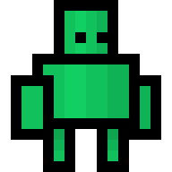

<p align="center"></p>

<h1 align="center">
  🕹️ State Driven Game Development Starter
</h1>

<p align="center">
  A template repository to kick start modern game development on the web built using HTML5 Canvas, TypeScript & Webpack.
</p>

---

- [Quick Start](#quick-start)
- [Overview](#overview)
- [Project Structure](#project-structure)
- [Game States](#game-states)
- [Sprites](#sprites)
- [Example Projects](#examples)

---

<h2 id="quick-start">🚀 Quick Start</h2>

### 🛑 Prerequisites

- `node` >= 14
- `npm` >= 6

### 🖥️ Local Development

Install dependencies.

```bash
npm i
```

Start the development server.

```bash
npm run start
```

See your game by opening your browser at `localhost:5000`.


Using the example code, it is possible to debug the game inputs by pressing `d` to understand how and when they are used. Pressing `m` shows an example menu to further demonstrate more difficult rendering tasks.

Changes made to the source files will trigger a recompilation. Refresh the browser to see the changes.

### 🛠️ Building

Building the project.

```bash
npm run build
```

The output will be located at `/dist`.

---

<h2 id="overview">📖 Overview</h2>

A game is comprised of stacked states, responsible for their own behaviours, rendering and lifecycle. All the states exist in a single stack which is processed on every animation frame.

Game state is managed by manipulating the `stack`; A first in, last out data structure.

Below is a short example flow.

| Step                                                                                               | Stack                                          | State            |
| -------------------------------------------------------------------------------------------------- | ---------------------------------------------- | ---------------- |
| Stack is initialised.                                                                              | `[]`                                           | `null`           |
| `StartState` is pushed onto the stack to start the game.                                           | `[StartState]`                                 | `StartState`     |
| `OverworldState` is pushed onto the stack.                                                         | `[StartState, OverworldState]`                 | `OverworldState` |
| An in-game battle occurs and `BattleState` is pushed onto the stack.                               | `[StartState, OverworldState, BattleState]`    | `BattleState`    |
| The battle ends and the stack is popped.                                                           | `[StartState, OverworldState]`                 | `OverworldState` |
| The player opens their inventory menu to heal themselves. `InventoryState` is pushed to the stack. | `[StartState, OverworldState, InventoryState]` | `InventoryState` |

---

<h2 id="project-structure">📚 Project Structure</h2>

```text
dist                          [Build output]
src                           [Source root]
  /assets                     [Web assets]
  /icons                      [Web icons]
  /lib                        [Game libraries]
    /core                     [Core libraries - @core]
    /models                   [Game models - @models]
    /sprites                  [Sprite definitions - @sprites]
    /state                    [State definitions - @state]
    /utils                    [Utility libraries - @utils]
    /game.ts                  [Game entry point - @game]
  /index.html                 [Web index page]
  /main.ts                    [App entry point]
  /manifest.webmanifest       [PWA manifest]
  /service-worker.js          [PWA service worker]
dev-server.js                 [Development express server]
tsconfig.json                 [TypeScript configuration]
tslint.json                   [tslint configuration]
webpack.config.js             [Webpack configuration]
```

<h2 id="game-states">🧩 Game States</h2>

Game states provide frame by frame functionality for your game.

### Creating States

Create a new state class, implementing the `State` interface and defining at least one handler method.

```ts
export class MyGameState implements State {
  enter(): void {
    console.log('Pushed to the stack!');
  }

  exit(): void {
    console.log('Popped from the stack!');
  }
}
```

They may implement a number of handler methods as described below.

### 🔄 Lifecycle Methods

A game state can implement the following optional lifecycle methods, called by the `stack`.

| Method                                        | Description                                                                                                                                                                                                                  |
| --------------------------------------------- | ---------------------------------------------------------------------------------------------------------------------------------------------------------------------------------------------------------------------------- |
| `enter(): void`                               | Called when this state is pushed to the stack, before its first `update`.                                                                                                                                                    |
| `update(frame: Frame): void`                  | Called with each invoke of `requestAnimationFrame` by the `game`. `Frame` data is provided which includes a current timestamp as well as a delta time. `update` is only called on the state that is at the top of the stack. |
| `render(ctx: CanvasRenderingContext2D): void` | Called after each `update` on the same frame. Provides the canvas rendering context as an argument.                                                                                                                          |
| `exit(): void`                                | Called when this state is popped off the stack.                                                                                                                                                                              |

### 🎮 Input Handling

If your state is interested in mouse and keyboard events, implement the following methods.

| Method                                 | Description        |
| -------------------------------------- | ------------------ |
| `keyup(event: KeyboardEvent): void`    | Key up event.      |
| `keydown(event: KeyboardEvent): void`  | Key down event.    |
| `keypress(event: KeyboardEvent): void` | Key press event.   |
| `mouseup(event: MouseEvent): void`     | Mouse up event.    |
| `mousedown(event: MouseEvent): void`   | Mouse down event.  |
| `mouseenter(event: MouseEvent): void`  | Mouse enter event. |
| `mouseleave(event: MouseEvent): void`  | Mouse leave event. |
| `mouseout(event: MouseEvent): void`    | Mouse out event.   |
| `mouseover(event: MouseEvent): void`   | Mouse over event.  |
| `mousemove(event: MouseEvent): void`   | Mouse move event.  |

### Using States

To advance your game to the next state, simply `push` an instance of your state to the game stack.

```ts
// Import the `game` object.
import game from '@game';

// Elsewhere in your code
game.stack.push(new MyGameState());
```

States can also be popped from the stack as long as it has states to `pop`.

```ts
// Remove top-most state
game.stack.pop();
```

<h2 id="sprites">👾 Sprites</h2>

Sprites are objects that render an image on a `HTMLCanvasContext2D`.

A sprite can be created in the following way.

```ts
import { Sprite } from '@core';

// Create and load the image to be rendered.
const image = new Image();
image.src = 'path/to/image.png';

// Create a sprite using the image and parameters.
const sprite = new Sprite(image, {
  // Source width
  w: 16,
  // Source height
  h: 16,
  // Origin x position
  ox: 0,
  // Origin y position
  oy: 0,
});
```

The sprite can be rendered to a canvas context.

```ts
sprite.render(ctx, {
  // Rendering x position
  x: 100,
  // Rendering y position
  y: 50,
});
```

Optionally, the sprite can be scaled in both directions.

```ts
sprite.render(ctx, {
  x: 100,
  y: 50,
  // Scale the sprite by 3
  scaleX: 3,
  scaleY: 3,
});
```

### Sprite Sheets

A `SpriteSheet` is used to define multiple `Sprite` objects from a single image.

A `SpriteSheet` is defined as follows.

```ts
const sprites = new SpriteSheet('/path/to/image.png');
```

Define sprites directly on the sprite sheet to build multiple sprites from the same image.

```ts
sprites
  .define('idle_1', { w: 16, h: 16, ox: 0, oy: 0 })
  .define('idle_2', { w: 16, h: 16, ox: 16, oy: 16 });
```

Sprites can then be retrieved from the sprite sheet.

```ts
/**
 * Note that, the `.get` method can return undefined.
 * Accommodate for this by optionally calling render
 * when doing so.
 *
 * `sprite?.render(ctx, config)`
 * */
const sprite = sprites.get('idle_1');
```

<h2 id="examples">💡 Example Projects</h2>

- tic-tac-toe - [[GitHub]](https://github.com/brookesb91/tic-tac-toe)
